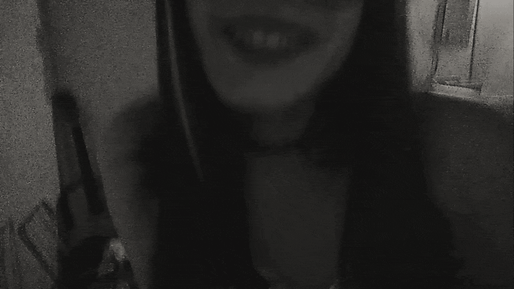

# MIRELA — Quem é aquela garota?

> Um pequeno documentário digital sobre duas vida, e também uma pessoa que se tornou parte da minha vida.

## Sobre

Eu fiz este site com o intuito de **presentear minha namorada**.

Ela é alguém muito importante para mim e, no fim das contas, percebi que aquilo que eu sei fazer melhor era transformar a nossa história em um documentário.

Em vez de tentar resumir tudo em uma carta, um presente ou algumas fotografias, criei um arquivo digital para guardar as coisas do jeito que eu enxergo: em capítulos, imagens, lembranças, textos e pequenos detalhes.

**Esse site** é um documento, um artigo sobre uma história, ao mesmo tempo, uma homenagem a ela e um registro de quem nós somos.

---

## ❤️ Por que eu fiz isso?

Porque eu queria dar para ela alguma coisa que tivesse a minha cara.

Eu não sabia fazer o presente perfeito. Mas sabia escrever, organizar imagens, criar uma página e contar uma história.

Então fiz isso.

Um documentário sobre a nossa vida.

Sobre a garota que um dia eu vi de longe e quis conhecer.
Sobre a mulher que acabou se tornando uma das pessoas mais importantes da minha vida.
Sobre nós dois.

E também sobre o cara que eu estou tentando me tornar.

> Algumas histórias não precisam ser perfeitas para merecer ser guardadas.

---

## 🔗 Links

**Site:** https://villernoirfilm.github.io/Mirela/

**Repositório:** https://github.com/villernoirfilm/Mirela

